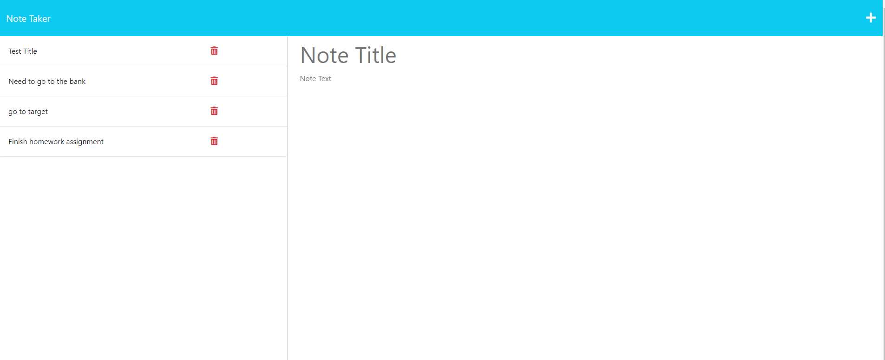

# Note Taker

# Description
  This week's project is to use Express.js to create a note-taking application. We received a starter code, which had all the code for the front end created. The only thing I focused on for this challenge was to build the back end to connect the server and client together. This applicatioon allows a user to create and save notes to help them keep track of the tasks they need to complete. 

  Here's the link to my deployed application: https://note-taker-aliya.herokuapp.com/notes

  Image of webpage:

  

  ### Installation

  To complete this project, I needed to install node.js and express.js on my computer to run code in the command line. I also needed to create an account with Heroku to be able to deploy my application directly to a live URL.

  ### Usage

  Here is the link to my gitHub repository: https://github.com/aliyajeylani/note_taker

  ### Credits
  
  N/A

  ### License

  N/A

 